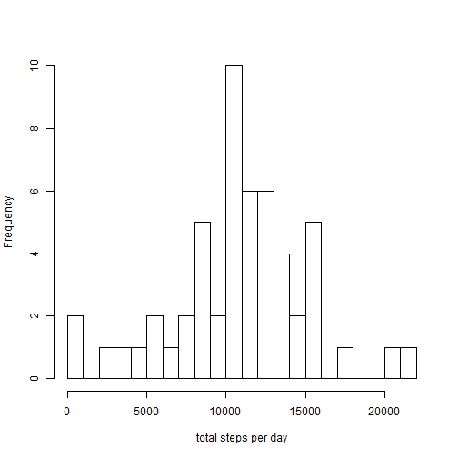
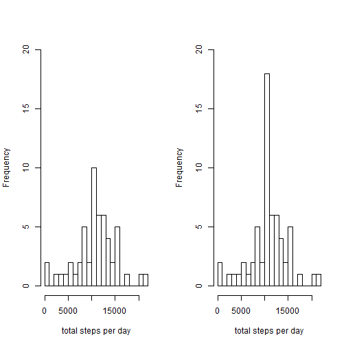
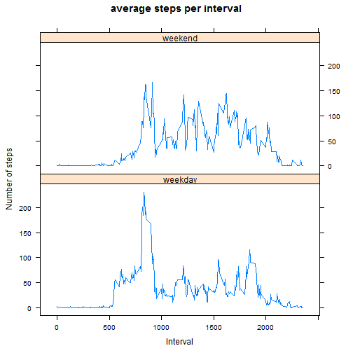

### Important:
In order to open the html output of this R markdown file in your browser, please click [on this link](https://htmlpreview.github.io/?https://github.com/HenkMeulendijks/RepData_PeerAssessment1/blob/master/PA1_template.html)


### Libraries
We start off with loading all the necessary libraries

```r
library(dplyr)
library(lattice)
```


###Loading and preprocessing the data
I have downloaded and unzipped the needed data file 

```r
mydatafile <- file.path("activity.csv")
```

Load the data (i.e. read.csv())

```r
mydata <- read.csv(mydatafile, header=TRUE, na.strings="NA" )
```

###Process/transform the data (if necessary) into a format suitable for your analysis
What is mean total number of steps taken per day?
 For this part of the assignment, you can ignore the missing values in the dataset.

```r
mydatanona <- na.omit(mydata)
```
1. Calculate the total number of steps taken per day

```r
mytotalstepsperday <- mydatanona %>% group_by(date) %>% summarise(totalsteps = sum(steps)) #summarize data
```
2. If you do not understand the difference between a histogram and a barplot, 
   research the difference between them. Make a histogram of the total number of steps taken each day  

```r
hist(mytotalstepsperday$totalsteps, breaks=30, xlab="total steps per day", main="")
```



3. Calculate and report the mean and median of the total number of steps taken per day

```r
mean(mytotalstepsperday$totalsteps) # mean of the total steps per day
```

```
## [1] 10766.19
```
dates that have no valid data at all (like 2012-10-01) have not been included in the calculation

```r
median(mytotalstepsperday$totalsteps) # median of the total steps per day 
```

```
## [1] 10765
```

### What is the average daily activity pattern? 
1. Make a time series plot (i.e. type = "l") of the 5-minute interval (x-axis) and the average 
 number of steps taken, averaged across all days (y-axis)

```r
myavgstepsperinterval <- mydatanona %>% group_by(interval) %>% summarise(avg = mean(steps)) #summarize data by average # steps
plot(myavgstepsperinterval, type="l", ylab="average of total steps per interval")
```


2. Which 5-minute interval, on average across all the days in the dataset, contains the maximum number of steps?

```r
mytotalstepsperinterval <- mydatanona %>% group_by(interval) %>% summarise(avg = sum(steps)) #summarize data by sum # steps
subset(mytotalstepsperinterval, avg==max(mytotalstepsperinterval))$interval #print the 5 minute interval with the max number of steps
```

```
## [1] 835
```
### Imputing missing values
1. Calculate and report the total number of missing values in the dataset (i.e. the total number of rows with NAs)

```r
mydata <- read.csv (mydatafile, header=TRUE, na.strings="NA" )
table(is.na(mydata$steps))
```

```
## 
## FALSE  TRUE 
## 15264  2304
```
2. Devise a strategy for filling in all of the missing values in the dataset. The strategy does not need to be sophisticated. For example, you could use the mean/median for that day, or the mean for that 5-minute interval, etc.

**Strategy**: The missing value will be replaced by the average # steps for that specific interval across all days.
This data is already available in myavgstepsperinterval. So I will left_join myavgstepsperinterval to the data and then replace the missing NA's. 

3. Create a new dataset that is equal to the original dataset but with the missing data filled in.


```r
myfixeddata<- mydata
myfixeddata <- myfixeddata %>% left_join(myavgstepsperinterval, by = "interval")
myfixeddata$steps[is.na(myfixeddata$steps)] <- myfixeddata$avg
table(is.na(myfixeddata$steps))
```

```
## 
## FALSE 
## 17568
```
4. Make a histogram of the total number of steps taken each day and Calculate 
and report the mean and median total number of steps taken per day. Do these 
values differ from the estimates from the first part of the assignment? What 
is the impact of imputing missing data on the estimates of the total daily 
number of steps?

```r
par(mfrow=c(1,2))
mytotalstepsperdayfixed  <- myfixeddata  %>% group_by(date) %>% summarise(sumsteps = sum(steps)) #summarize data
hist(mytotalstepsperday$totalsteps, breaks = 30, ylim= c(0,20), main="", xlab="total steps per day")
hist(mytotalstepsperdayfixed$sumsteps, breaks = 30, ylim= c(0,20), main="", xlab = "total steps per day")
```



```r
mean(mytotalstepsperdayfixed$sumsteps) # mean of the total steps per day
```

```
## [1] 10766.19
```

```r
median(mytotalstepsperdayfixed$sumsteps) # median of the total steps per day 
```

```
## [1] 10766.19
```

### Are there differences in activity patterns between weekdays and weekends?
1. Create a new factor variable in the dataset with two levels - "weekday" and 
"weekend" indicating whether a given date is a weekday or weekend day.

```r
myfixeddata$date <- as.Date(myfixeddata$date, format = "%Y-%m-%d")
myfixeddata$weekday <- weekdays(myfixeddata$date)
myfixeddata$blnweekday <- ifelse((weekdays(myfixeddata$date) %in% c("Saturday","Sunday")), "weekend","weekday")
```
2. Make a panel plot containing a time series plot (i.e. type = "l") of the 
5-minute interval (x-axis) and the average number of steps taken, averaged 
across all weekday days or weekend days (y-axis). See the README file in the 
GitHub repository to see an example of what this plot should look like using 
simulated data.

```r
myavgstepsperintervalonweekday <- myfixeddata  %>% group_by(blnweekday, interval) %>% summarise(avg = mean(steps)) #summarize data
xyplot(avg~interval | factor(blnweekday), data=myavgstepsperintervalonweekday, 
       main="average steps per interval", xlab="Interval",  ylab="Number of steps",layout=c(1,2),type="l")
```



